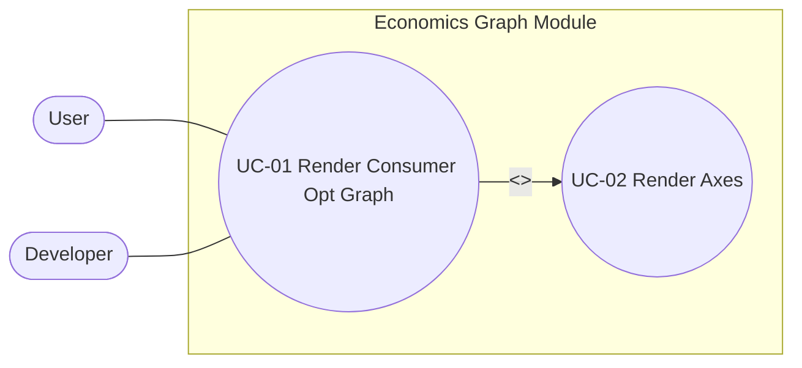

Model：consumer.ts

Model→View 的轉換：Viewport.ts、ConsumerOptScene.ts

ViewModel / 契約：drawables.ts

View：SvgScene.tsx、Axes.tsx、ConsumerOptGraph.tsx（主要是 View）

Controller（還沒做出來）：未來會是 onChange/onMouse... 或 InteractionController.ts

